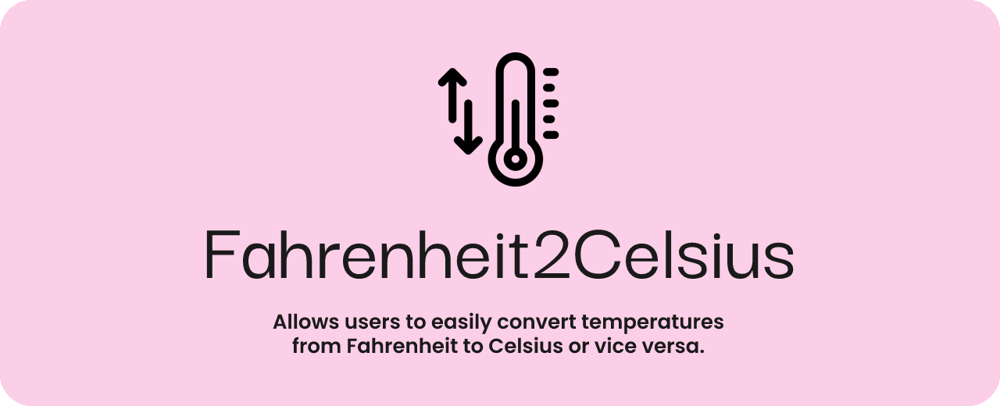

------

## How to Run
To run the application, you can either clone the repository to your local machine or run it on the web using Repl.it.

### Running on Repl.it
- Go to the [Fahrenheit2Celsius cover page](www.replit.com/) at Repl.it.
- Click on the green "Run" button to start the application.
- Follow the prompts to convert your temperature!
### Running Locally
- Clone the repository to your local machine using git clone https://github.com/<your-username>/Fahrenheit2Celsius.git.
- Navigate to the project directory using cd Fahrenheit2Celsius.
- Run the application using lua main.lua.
- Follow the prompts to convert your temperature!

## Dependencies
This project was built using Lua and has no external dependencies.
